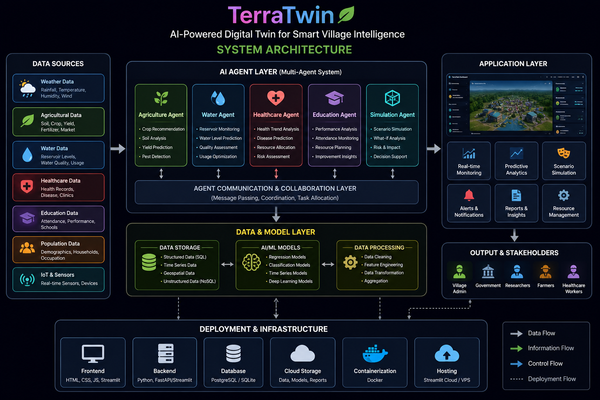
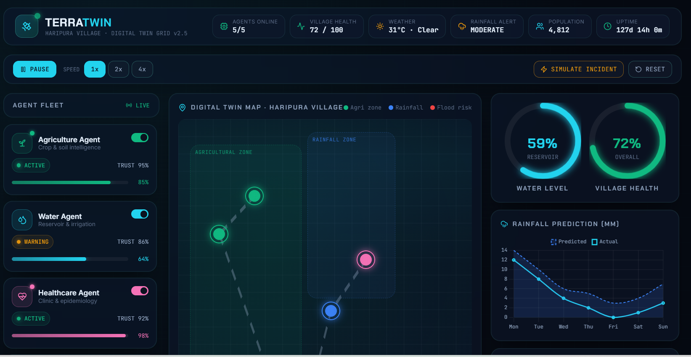
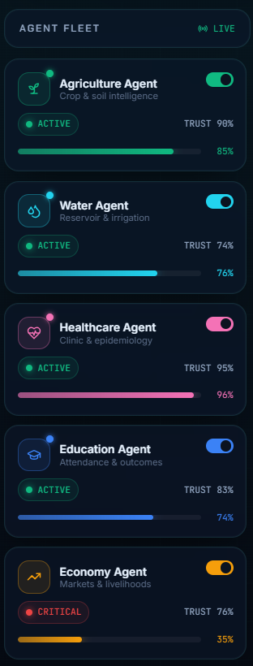
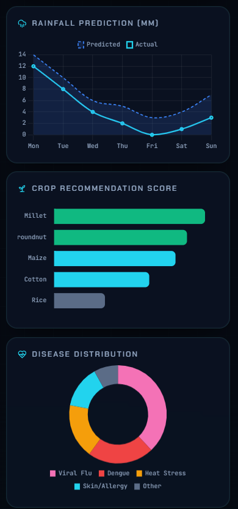
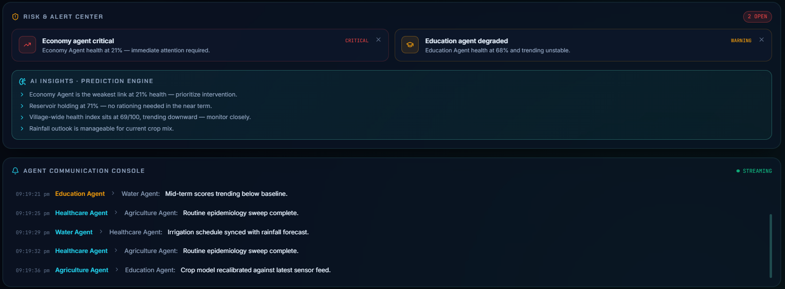

# TerraTwin: AI-Powered Digital Twin for Smart Village Intelligence

<p align="center">
  
</p>

<p align="center">
  <b>Multi-Agent AI Digital Twin Platform for Sustainable Village Development</b>
</p>

---

## Overview

TerraTwin is an AI-powered digital twin platform designed to simulate and analyze rural ecosystems using multiple intelligent agents.

The system models critical village sectors including:

- Agriculture
- Water Resources
- Healthcare
- Education
- Disaster Preparedness

Each domain is represented by an autonomous AI agent that monitors data, performs predictions, generates recommendations, and simulates future scenarios.

TerraTwin enables data-driven decision making for sustainable and resilient villages.

---

# Problem Statement

Rural communities face interconnected challenges involving agriculture, healthcare, water scarcity, and education.

Traditional systems operate independently and fail to capture the relationship between these sectors.

TerraTwin addresses this problem by creating a digital twin of a village where AI agents collaborate to:

- Predict future conditions
- Analyze risks
- Recommend actions
- Simulate alternative scenarios

---

# Objectives

- Develop a village-scale digital twin.
- Build multiple intelligent AI agents.
- Predict agricultural and environmental outcomes.
- Monitor healthcare and education indicators.
- Simulate village development scenarios.
- Support sustainable decision making.

---

# System Architecture

<p align="center">
  
</p>

The architecture consists of:

1. Data Layer
2. Machine Learning Models
3. Domain-Specific AI Agents
4. Simulation Engine
5. Digital Twin Dashboard
6. Decision Support System

---

# AI Agents

## Agriculture Agent

- Crop recommendation
- Yield prediction
- Soil analysis
- Agricultural alerts

---

## Water Agent

- Rainfall prediction
- Water availability analysis
- Resource optimization
- Risk monitoring

---

## Healthcare Agent

- Disease prediction
- Health monitoring
- Medical alerts
- Healthcare recommendations

---

## Education Agent

- Student performance prediction
- Educational analytics
- Learning indicators
- Performance monitoring

---

## Simulation Agent

- Village scenario analysis
- Future predictions
- Multi-agent collaboration
- Decision support

---

# Features

- Multi-Agent Architecture
- Digital Twin Simulation
- Machine Learning Predictions
- Interactive Dashboard
- Scenario Analysis
- Crop Recommendation
- Rainfall Forecasting
- Healthcare Prediction
- Educational Analytics
- Decision Support System

---

# Project Structure

```text
TerraTwin/
│
├── agents/
├── dashboard/
├── datasets/
├── deployment/
├── docs/
├── models/
├── notebooks/
├── screenshots/
│
├── app.py
├── main.py
├── terratwin.html
├── requirements.txt
├── README.md
└── LICENSE
```

---

# Datasets

| Domain | Dataset |
|-------|----------|
| Agriculture | Crop Recommendation Dataset |
| Rainfall | India Rainfall Dataset |
| Healthcare | Disease Prediction Dataset |
| Education | Student Performance Dataset |

---

# Machine Learning Models

- Random Forest
- Decision Tree
- Classification Models
- Regression Models

---

# Technologies Used

## Programming

- Python
- HTML
- CSS
- JavaScript

## Libraries

- Streamlit
- Pandas
- NumPy
- Scikit-learn

## Development Tools

- Jupyter Notebook
- VS Code
- Git
- GitHub

---

# Dashboard Screenshots

## Main Dashboard

<p align="center">

</p>

---

## AI Agents

<p align="center">

</p>

---

## Predictions

<p align="center">

</p>

---

## Alerts

<p align="center">

</p>

---

# Installation

Clone the repository:

```bash
git clone https://github.com/nithish1492/TerraTwin.git
```

Move into the project:

```bash
cd TerraTwin
```

Install dependencies:

```bash
pip install -r requirements.txt
```

Run the application:

```bash
streamlit run app.py
```

---

# Future Enhancements

- IoT sensor integration
- Satellite imagery analysis
- Real-time weather APIs
- Smart irrigation systems
- Mobile application
- Government analytics dashboard
- Disaster management module

---

# Applications

- Smart Villages
- Rural Planning
- Agricultural Analytics
- Water Resource Management
- Healthcare Monitoring
- Educational Planning
- Sustainability Research

---

# Research Scope

TerraTwin demonstrates how Digital Twins and Multi-Agent AI can be applied to rural intelligence systems.

Potential research areas include:

- Agent collaboration
- Rural analytics
- Sustainable development
- AI-based governance
- Climate resilience

---

# Contributors

**nithish1492**

---

# License

This project is licensed under the MIT License.

---

# Citation

```text
TerraTwin: AI-Powered Digital Twin for Smart Village Intelligence
2026
```

---

<p align="center">
Developed for AI Agent Systems, Digital Twins, and Sustainable Smart Villages.
</p>
